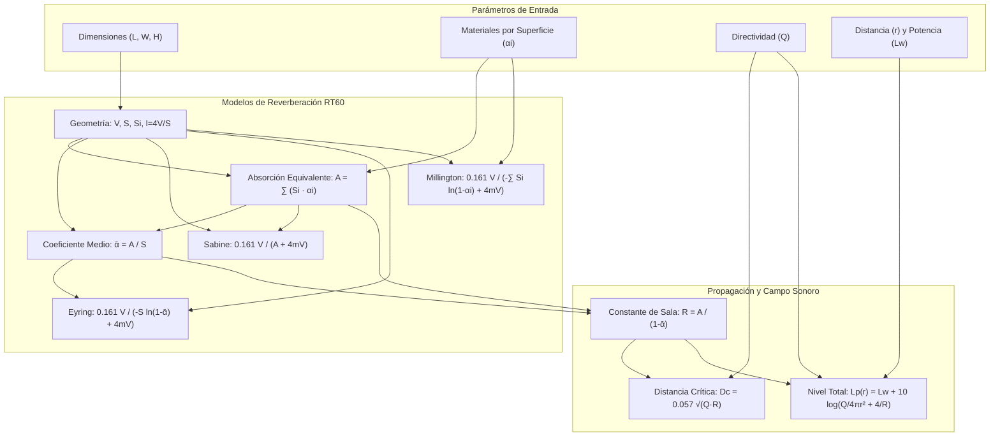

# 🔊 POZOLE
### **P**ropagación de **O**ndas en **Z**onas y **O**ptimización de **L**ímites **E**spaciales

> **Simulador Profesional e Interactivo de Campo Sonoro y Acústica de Recintos**  
> Desarrollado para la asignatura **Acústica de Recintos 2026**.

---

## 👥 Integrantes del Equipo

- 👨‍💻 **Daniel Angulo**
- 👨‍💻 **Jeronimo Gomez**
- 👨‍💻 **Brandon Guerra**

---

## 📌 Visión General del Proyecto

**POZOLE** es una suite de ingeniería física e interfaz interactiva desarrollada en **React 18** y **Vite** con diseño minimalista inspirado en los estándares de Apple y Tesla. La herramienta permite simular, analizar y optimizar el comportamiento acústico de recintos paralelepipédicos cerrados en bandas de octava estándar (**125 Hz a 4000 Hz**).

Implementa de forma matemática rigurosa los tres modelos clásicos de tiempo de reverberación ($RT_{60}$): **Sabine**, **Norris-Eyring** y **Millington-Sette**, considerando la disipación atmosférica del aire ($4mV$), directividad espacial de la fuente ($Q = 1, 2, 4, 8$), constante de sala ($R$), distancia crítica ($D_c$), nivel de presión sonora espacial ($L_p$) y propagación en campo directo y reverberado.

---

## 🚀 Características Principales

- 📐 **Geometría y Volumen Dinámico**: Cálculo instantáneo del volumen ($V$), área de las 6 superficies individuales ($S_i$), superficie total ($S$) y recorrido libre medio ($l = 4V/S$).
- 🎨 **Asignación Reactiva de Materiales**: Base de datos de materiales estándar (ISO 354) con coeficientes de absorción ($\alpha$) por octava, edición manual y duplicación rápida entre paredes.
- 🎛️ **Simulador de Fuente y Receptor**: Ajuste interactivo de nivel de potencia ($L_w$ en dB / Watts), directividad ($Q$), distancia ($r$), y switch de absorción atmosférica del aire ($m$).
- 🧊 **Visualizador 3D Interactivo**: Motor SVG ortográfico en perspectiva 3D con rotación orbital con ratón/touch, zoom por rueda independiente del scroll de página, raytracing de reflexión primaria y halo visual de Distancia Crítica ($D_c$).
- 📈 **Gráficas Interactivas con Recharts**:
  1. **$RT_{60}$ vs Frecuencia**: Comparativa multimodelo (Sabine vs Eyring vs Millington) con resaltado de la banda óptima DIN 18041 / ISO 3382 según el uso de la sala.
  2. **$L_p$ vs Distancia**: Curva de decaimiento espacial con asíntota de campo directo ($-6\text{ dB/dd}$), campo reverberado constante y marcador vertical $D_c$.
- 📄 **Informes Técnicos e Exportación**:
  - Generación de **Informe Técnico Imprimible / PDF** formal con firmas de revisión.
  - Exportación de datos de cálculo a archivos **Excel / CSV** compatibles con formato en español.

---

## 🧠 Flujo de Lógica Física y Matemáticas



---

## 📐 Modelos Matemáticos Implementados

### 1. Geometría y Absorción Equivalente
- **Volumen del recinto**: $V = L \cdot W \cdot H \quad [\text{m}^3]$
- **Superficie total**: $S = 2(LW + LH + WH) \quad [\text{m}^2]$
- **Absorción equivalente por banda**: $A(f) = \sum_{i=1}^{6} (S_i \cdot \alpha_i(f)) \quad [\text{m}^2 \text{ Sabine}]$
- **Coeficiente de absorción medio**: $\bar{\alpha}(f) = \frac{A(f)}{S} \quad [\text{adimensional}]$

### 2. Tiempos de Reverberación ($RT_{60}$)
- **Modelo de Sabine (1898)**:
  $$RT_{\text{Sabine}} = \frac{0.161 \cdot V}{A + 4mV}$$
- **Modelo de Norris-Eyring (1930)**:
  $$RT_{\text{Eyring}} = \frac{0.161 \cdot V}{-S \cdot \ln(1 - \bar{\alpha}) + 4mV}$$
- **Modelo de Millington-Sette (1932)**:
  $$RT_{\text{Millington}} = \frac{0.161 \cdot V}{-\sum_{i=1}^{6} [S_i \cdot \ln(1 - \alpha_i)] + 4mV}$$

### 3. Propagación Espacial y Campo Sonoro
- **Constante de Sala ($R$)**:
  $$R = \frac{A}{1 - \bar{\alpha}} \quad [\text{m}^2]$$
- **Distancia Crítica ($D_c$)**:
  $$D_c = 0.057 \cdot \sqrt{Q \cdot R} \quad [\text{m}]$$
- **Nivel de Presión Sonora Total ($L_p$)**:
  $$L_p(r) = L_w + 10 \cdot \log_{10} \left( \frac{Q}{4\pi r^2} + \frac{4}{R} \right) - \Delta L_{\text{aire}}$$
- **Relación Directo / Reverberado (DRR)**:
  $$\text{DRR} = 10 \cdot \log_{10} \left( \frac{Q \cdot R}{16\pi r^2} \right) \quad [\text{dB}]$$

---

## 🛠️ Arquitectura de Archivos del Proyecto

```text
acusticasoftware/
├── public/
│   └── soundwave.svg
├── src/
│   ├── components/
│   │   ├── AcousticCharts.jsx       # Gráficas RT vs Freq y Lp vs Distancia
│   │   ├── AcousticResults.jsx      # Tablas y tarjetas KPI por bandas
│   │   ├── ExportModal.jsx          # Exportación Excel/CSV
│   │   ├── Header.jsx               # Encabezado principal con marca POZOLE
│   │   ├── OverviewDashboard.jsx    # Dashboard resumen ejecutivo
│   │   ├── PozoleLogo.jsx           # Componente del logo estilizado SVG
│   │   ├── ReportModal.jsx          # Informe técnico imprimible / PDF
│   │   ├── RoomDimensions.jsx       # Entrada de geometría y proporciones
│   │   ├── RoomVisualizer.jsx       # Visualizador 3D interactivo con zoom
│   │   ├── Sidebar.jsx              # Navegación lateral de módulos
│   │   ├── SourceReceiver.jsx       # Parámetros de fuente sonora y receptor
│   │   ├── SurfaceMaterials.jsx     # Asignación de materiales y α por banda
│   │   └── TheoryModal.jsx          # Formulario físico e hidrología acústica
│   ├── utils/
│   │   ├── acousticCalculations.js  # Motor puro de cálculo físico y fórmulas
│   │   ├── defaultMaterials.js      # Base de datos de materiales ISO 354
│   │   └── roomPresets.js           # Escenarios típicos predefinidos
│   ├── App.jsx                      # Componente raíz con estado global
│   ├── main.jsx                     # Punto de entrada de React
│   └── index.css                    # Estilos Tailwind y utilidades
├── index.html                       # Documento principal HTML5
├── package.json                     # Dependencias y scripts Vite
├── tailwind.config.js               # Configuración de Tailwind CSS
└── vite.config.js                   # Configuración del bundler Vite
